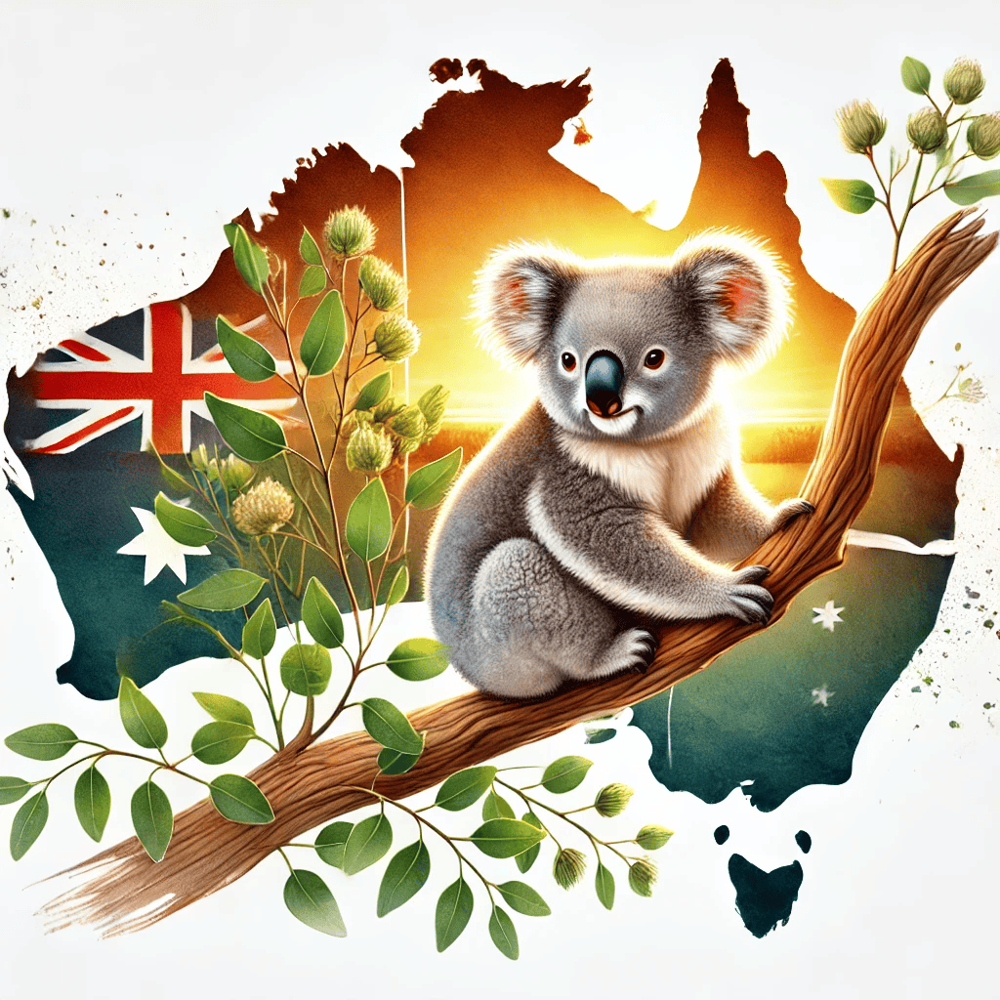
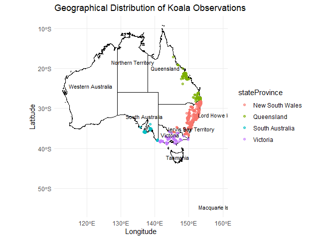

<!-- README.md is generated from README.Rmd. Please edit that file -->
<!-- badges: start -->
<!-- badges: end -->

# ecotourism <a href='https://github.com/harshitha1201/ecotourism'></a>

## Overview

ecotourism is an R package for retrieving and analyzing wildlife
occurrence data, currently focused on Koala records from the Atlas of
Living Australia. Future updates will include more species, tourism
data, and weather insights.

## Installation

You can install the development version of **ecotourism** from
[GitHub](https://github.com/) with:

``` r

install.packages("remotes")
remotes::install_github("harshitha1201/ecotourism")
```

## Example

``` r
library(dplyr)
#> 
#> Attaching package: 'dplyr'
#> The following objects are masked from 'package:stats':
#> 
#>     filter, lag
#> The following objects are masked from 'package:base':
#> 
#>     intersect, setdiff, setequal, union
library(galah)
#> galah: version 2.1.1
#> ℹ Default node set to ALA (ala.org.au).
#> ℹ See all supported GBIF nodes with `show_all(atlases)`.
#> ℹ To change nodes, use e.g. `galah_config(atlas = "GBIF")`.
#> 
#> Attaching package: 'galah'
#> The following object is masked from 'package:dplyr':
#> 
#>     desc
#> The following object is masked from 'package:stats':
#> 
#>     filter

koala_data <- read.csv("inst/extdata/koala_data.csv")
head(koala_data)
#>    eventDate decimalLatitude decimalLongitude individualCount stateProvince
#> 1 2023-01-01       -28.16035         153.4447               1    Queensland
#> 2 2023-01-01       -27.90909         153.3416               1    Queensland
#> 3 2023-01-01       -27.84189         153.2949               1    Queensland
#> 4 2023-01-01       -28.14216         153.4438               1    Queensland
#> 5 2023-01-01       -28.11092         153.4037               1    Queensland
#> 6 2023-01-01       -28.14700         153.4238               1    Queensland
#>               habitat_type conservation_status conservation_source
#> 1 South Eastern Queensland          Vulnerable     QLD NC Act 1992
#> 2 South Eastern Queensland          Vulnerable     QLD NC Act 1992
#> 3 South Eastern Queensland          Vulnerable     QLD NC Act 1992
#> 4 South Eastern Queensland          Vulnerable     QLD NC Act 1992
#> 5 South Eastern Queensland          Vulnerable     QLD NC Act 1992
#> 6 South Eastern Queensland          Vulnerable     QLD NC Act 1992
```

``` r
library(ggplot2)
library(rnaturalearth)

australia_map <- ne_states(country = "Australia", returnclass = "sf")

ggplot() +
  geom_sf(data = australia_map, fill = "white", color = "black") +
  geom_point(data = koala_data, aes(x = decimalLongitude, y = decimalLatitude, color = stateProvince), alpha = 0.6) +
  geom_sf_text(data = australia_map, aes(label = name), size = 3, check_overlap = TRUE) +
  labs(title = "Geographical Distribution of Koala Observations",
       x = "Longitude",
       y = "Latitude") +
  theme_minimal()
#> Warning in st_point_on_surface.sfc(sf::st_zm(x)): st_point_on_surface may not
#> give correct results for longitude/latitude data
```


